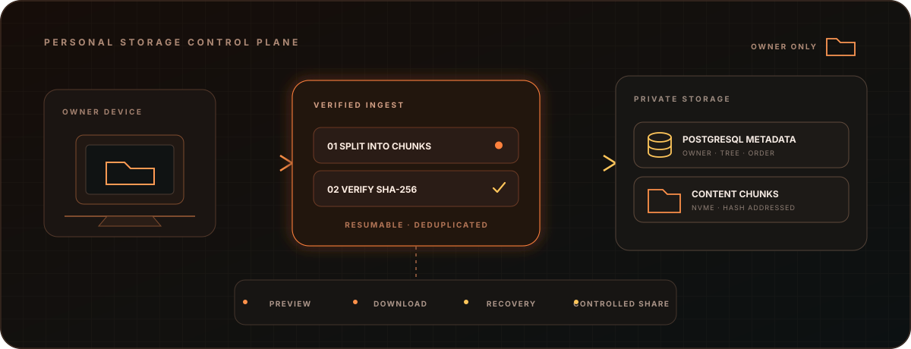
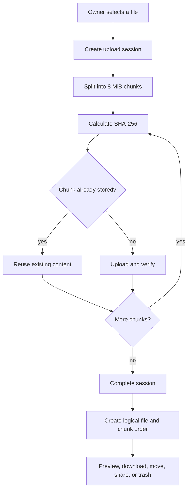

<p align="center">
  
</p>

<h1 align="center">Arsiva</h1>

<p align="center">
  A personal file workspace with verified resumable uploads, content deduplication, previews, recovery, and controlled sharing.
</p>

<p align="center">
  <a href="DOCUMENTATION.md">Documentation</a> ·
  <a href="docs/ARCHITECTURE.md">Architecture</a> ·
  <a href="docs/API_REFERENCE.md">API</a> ·
  <a href="docs/OPERATIONS.md">Operations</a> ·
  <a href="docs/SECURITY.md">Security</a>
</p>

> [!IMPORTANT]
> This is a personal NAS. Registration is closed by default. A fresh installation can temporarily enable owner bootstrap, and the backend accepts only the first account. Once an owner exists, further registration is rejected even if the bootstrap flag remains enabled.

## Overview

Arsiva is a personal storage platform designed for Orange Pi 4A. It combines a responsive React workspace, an Express API, PostgreSQL metadata, and content-addressed file storage. The browser uploads verified chunks that can resume after interruption. The server assembles logical files from ordered hashes, streams full or partial content, manages trash and cleanup, and creates revocable public links when the owner chooses to share something.

The production image serves the web application and API from one origin. Docker Compose mounts PostgreSQL and file data on the host so application images can be replaced without moving stored content.

## Core capabilities

| Workspace | What it does |
| --- | --- |
| Files and folders | Browse, create folders, search, rename, move, multi-select, trash, restore, and purge |
| Reliable upload | Splits files into 8 MiB chunks, verifies SHA-256, resumes sessions, and reports live progress |
| Efficient storage | Reuses identical content-addressed chunks across logical files |
| Delivery | Streams downloads and previews with `GET`, `HEAD`, and HTTP Range support |
| Sharing | Creates random bearer-token links with optional expiration and explicit revocation |
| Operations | Reports service and system state, migrates schema, purges retained trash, and collects orphan chunks |
| Responsive UI | Supports desktop navigation, mobile drawer, breadcrumbs, background upload, and media preview |

## Storage lifecycle



PostgreSQL stores ownership, hierarchy, file metadata, chunk order, sessions, and shares. `/opt/nas/data` stores the actual chunk payload. Both must be backed up and restored as one consistency set.

## Personal owner access

Normal configuration keeps registration disabled:

```env
NAS_ALLOW_OWNER_BOOTSTRAP=false
```

For a new empty database only:

1. Set `NAS_ALLOW_OWNER_BOOTSTRAP=true` in `.env`.
2. Restart the API container.
3. Open the login page and select **Aktivasi Pemilik**.
4. Create the single owner account.
5. Return the flag to `false` and restart the API.

The API serializes owner creation with a PostgreSQL advisory transaction lock. If an account already exists, `POST /api/auth/register` returns `403` regardless of the email address. The web interface hides owner activation when bootstrap is disabled or an owner exists.

## Quick start

### Requirements

- a maintained 64-bit Linux host;
- Docker Engine and Docker Compose;
- reliable storage mounted for PostgreSQL and file data;
- a completed `.env` based on `.env.example`.

```bash
cp .env.example .env
docker compose up -d --build
curl --fail http://localhost:3001/api/health
```

Open `http://localhost:3001`. For an empty installation, follow the owner bootstrap procedure above before returning the service to its closed registration mode.

## Browser routes

| Route | Purpose |
| --- | --- |
| `/` and `/files` | Root workspace |
| `/f/:folderId` | Folder contents |
| `/search` | Owner file search |
| `/trash` | Restore or permanently purge trashed items |
| `/shared` | Review and revoke owned share links |
| `/s/:token` | Public shared content |

## API groups

| Group | Base path | Access |
| --- | --- | --- |
| Authentication | `/api/auth` | Public login, conditional owner bootstrap, authenticated logout and identity |
| Nodes | `/api/nodes` | Owner session |
| Uploads | `/api/uploads` | Owner session |
| Shares | `/api/shares` | Owner session |
| System | `/api/system` | Owner session |
| Public share | `/s/:token` | Valid share token |
| Health | `/api/health` | Public health route |

Request methods, content headers, status behavior, and upload sequencing are documented in the [API reference](docs/API_REFERENCE.md).

## Deployment layout

```text
Browser
   |
HTTPS or private network
   |
Express API + React build :3001
   |                    |
PostgreSQL metadata     /opt/nas/data chunks
```

Compose includes an optional Cloudflare Tunnel profile. Tailscale can provide private SSH and operator access. A tunnel protects transport but does not replace application authorization, registration control, backup, or host hardening.

## Data protection

- passwords are hashed with Argon2;
- production cookies use `HttpOnly`, `Secure`, and `SameSite=Lax`;
- session and share tokens use random 32-byte values;
- node operations verify ownership;
- chunk writes verify declared length and SHA-256;
- share links can expire or be revoked;
- permanent purge remains separate from trash.

Public share tokens are credentials. Anyone holding a valid link can access its target until expiration or revocation.

## Backup and recovery

Capture PostgreSQL and `/opt/nas/data` together. A database-only backup can reference missing chunks. A data-only backup loses file names, hierarchy, owners, ordering, and shares. Detailed backup, restore, validation, and incident procedures are in [Operations](docs/OPERATIONS.md).

## Repository map

```text
apps/api/src/              Express routes, auth, storage, migrations, and jobs
apps/web/src/              React workspace and upload manager
packages/shared/src/       Shared validation and TypeScript contracts
infra/deploy.sh            Orange Pi deployment helper
docs/                      Architecture, API, operations, and security
docker-compose.yml         PostgreSQL, API, storage mounts, and optional tunnel
Dockerfile                 Multi-stage production image
```

## Development and validation

```bash
corepack enable
pnpm install
pnpm -r build
```

The repository does not yet define a complete automated integration suite. Release verification should cover login, closed registration, first-owner concurrency, upload interruption and resume, hash rejection, Range download, share expiration, trash restore, purge, and backup restoration.

## Documentation

Start with [DOCUMENTATION.md](DOCUMENTATION.md). It links the complete system design, API contract, owner access policy, operations handbook, storage model, troubleshooting, and security posture.

## Credits and license

Built with Node.js, TypeScript, React, React Router, TanStack Query, Vite, Express, PostgreSQL, node-postgres, Argon2, Zod, Lucide, Docker, Cloudflare Tunnel, and Tailscale. Project names and trademarks belong to their respective owners.

No public license is included. Source availability does not grant permission to copy, modify, redistribute, host, or create derivative works.
