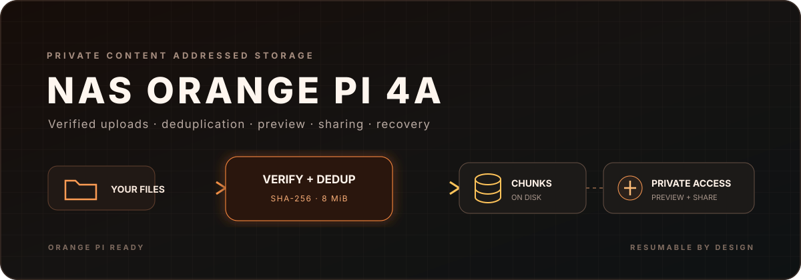
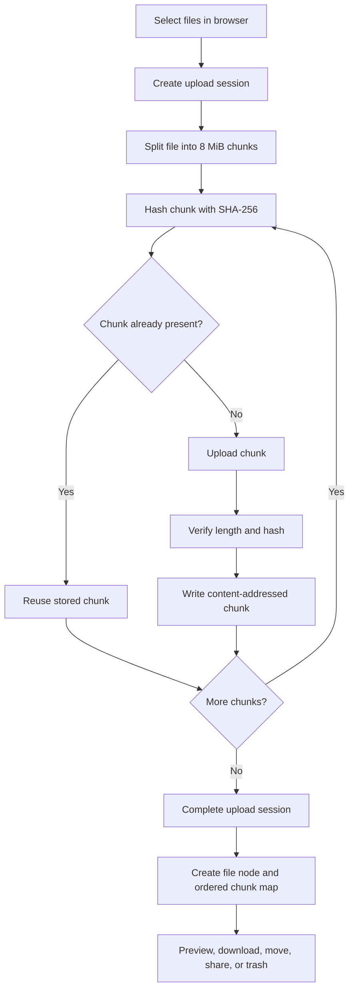

# NAS Orange Pi 4A

<p align="center">
  
</p>

<p align="center">
  <strong>A self-hosted file workspace with resumable verified uploads, content deduplication, previews, sharing, and responsive controls.</strong>
</p>

<p align="center">
  
  
  
  
  
  
</p>

> [!CAUTION]
> This service stores private files and can publish bearer-token share links. The current session cookie is configured with `secure: false`, and public registration has no rate limit or invitation gate. Complete the hardening steps in [Security](docs/SECURITY.md) before exposing the service to the internet.

NAS Orange Pi 4A is a compact React and Express storage platform designed for an Orange Pi or another Linux host. Files are split into verified content-addressed chunks, which allows interrupted uploads to resume and identical data to be reused. PostgreSQL stores users, file trees, chunk references, upload sessions, shares, and sessions while the file payload stays on mounted storage.

[Documentation index](DOCUMENTATION.md) | [Architecture](docs/ARCHITECTURE.md) | [API reference](docs/API_REFERENCE.md) | [Operations](docs/OPERATIONS.md) | [Security](docs/SECURITY.md)

## Capabilities

| Area | Capability |
| --- | --- |
| File workspace | Folders, rename, move, search, multi-select, trash, restore, and permanent purge |
| Reliable upload | 8 MiB chunks, browser SHA-256, resumable sessions, concurrent transfer, and progress |
| Efficient storage | Content-addressed chunks and deduplication across file versions |
| Delivery | Full downloads, HTTP Range, media preview, and cache-aware static serving |
| Sharing | Revocable public links with optional expiration and preview or download |
| Operations | Health endpoint, system information, schema migrations, trash cleanup, and orphan collection |
| Interface | Responsive desktop layout, mobile drawer, breadcrumbs, upload manager, and media studio |

## How a file is stored



The database never contains the file bytes. It maps a logical file node to ordered chunk hashes. The data volume stores each unique verified chunk once.

## Workspace layout

```text
apps/
  api/                    Express API, auth, storage, migrations, and jobs
  web/                    React application and upload manager
packages/
  shared/                 Shared TypeScript contracts and validation
infra/
  deploy.sh               Orange Pi deployment helper
docker-compose.yml        PostgreSQL, application, and optional tunnel
Dockerfile                Multi-stage production image
docs/                     Architecture, API, operations, and security
```

## Quick start

### Requirements

- Docker Engine with Docker Compose, or Node.js 22 and pnpm 12 for development
- A writable storage path
- PostgreSQL 17 when running outside Compose

```bash
cp .env.example .env
docker compose up -d --build
curl --fail http://localhost:3001/api/health
```

The Compose deployment persists PostgreSQL at `/opt/nas/db` and file chunks at `/opt/nas/data`. Create those paths with restrictive ownership before the first start.

Open `http://localhost:3001`. The Express service serves the built React application and the API from one origin.

## Development

```bash
corepack enable
pnpm install
pnpm -r build
```

Run the package scripts defined in the workspace for local API and web development. The shared package must build before dependent packages.

## Main routes

| Browser route | Purpose |
| --- | --- |
| `/` and `/files` | Root file workspace |
| `/f/:folderId` | Folder contents |
| `/search` | File and folder search |
| `/trash` | Restore or permanently purge items |
| `/shared` | Manage share links |
| `/s/:token` | Public shared item |

The API exposes authentication, node management, chunk upload, downloads with Range support, public shares, system information, and health. See the complete [API reference](docs/API_REFERENCE.md).

## Storage and cleanup

Deleting an item moves its node tree to trash. Purging removes the logical nodes. Background maintenance clears expired trash and removes chunks that no file or active upload references. Back up PostgreSQL and the data volume together so their references remain consistent.

## Deployment

The included `infra/deploy.sh` packages the repository, copies it to the Orange Pi through SSH, starts Compose, and applies migrations. Its default host and remote path are environment-specific examples. Override them rather than copying another deployment address into a new environment.

The optional `tunnel` Compose profile starts Cloudflare Tunnel when `CLOUDFLARE_TUNNEL_TOKEN` is set:

```bash
docker compose --profile tunnel up -d --build
```

Before public deployment, enable secure cookies in HTTPS, restrict registration, add authentication rate limiting, and review public share retention.

## Validation

The repository does not currently define an automated test suite. The primary deterministic check is:

```bash
pnpm -r build
```

For release verification, also test registration policy, login and logout, upload interruption and resume, hash rejection, Range download, share expiration, trash restore, purge, and backup restoration on a non-production instance.

## Credits

NAS Orange Pi 4A is built with [Node.js](https://nodejs.org/), [TypeScript](https://www.typescriptlang.org/), [React](https://react.dev/), [React Router](https://reactrouter.com/), [TanStack Query](https://tanstack.com/query), [Vite](https://vite.dev/), [Express](https://expressjs.com/), [PostgreSQL](https://www.postgresql.org/), [node-postgres](https://node-postgres.com/), [Argon2](https://github.com/P-H-C/phc-winner-argon2), [Zod](https://zod.dev/), [Lucide](https://lucide.dev/), [Docker](https://www.docker.com/), [Cloudflare Tunnel](https://developers.cloudflare.com/cloudflare-one/connections/connect-networks/), and [Tailscale](https://tailscale.com/).

## License

No public license is currently included. Copyright remains with the repository owner. Source availability alone does not grant rights to copy, modify, redistribute, host, or create derivative works.
