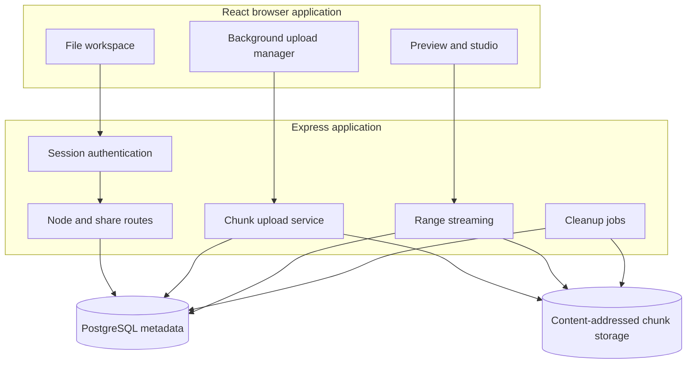

# Architecture

## System context

The production container serves both the compiled React application and the Express API. This same-origin design simplifies session cookies and deployment. PostgreSQL holds metadata; the mounted data path holds file chunks.

## Domain model

Users own a tree of nodes. A node represents a folder or file and can be active, trashed, or purged. A file node references ordered records in `node_chunks`. Each record points to a chunk hash and records its position in the file.

Upload sessions describe work in progress. Their chunk records allow the browser to ask which chunks already exist and continue after interruption. Share links point to a node through a random bearer token and may expire or be revoked.

The core tables are:

- `users` and `sessions`;
- `nodes` and `node_chunks`;
- `upload_sessions` and `upload_session_chunks`;
- `share_links`;
- `schema_migrations`.

## Upload lifecycle

1. The browser creates an upload session with file name, size, parent, and chunk metadata.
2. The file is divided into 8 MiB chunks.
3. The browser computes SHA-256 with Web Crypto when available.
4. Existing chunks can be skipped and reused.
5. Missing chunks are sent with their expected hash and length.
6. Express verifies `Content-Length` and `X-Chunk-Sha256`.
7. A verified chunk is stored under its content hash.
8. Completion validates the ordered set and creates the logical file node.

XHR supplies transfer progress, while the upload manager controls concurrent and background work. The server remains the authority for integrity and completion.

## Deduplication

Chunk content is addressed by SHA-256. Identical chunks share one physical payload while different files retain independent ordered references. Deduplication saves space but makes the reference database essential. Removing a file does not immediately remove a shared chunk.

Orphan collection deletes only chunks that are no longer referenced by files or active uploads. A faulty or stale database restore can therefore make valid disk chunks appear orphaned.

## Downloads and previews

Authenticated file delivery and public shares reconstruct a file by reading its chunk sequence. The stream service supports full responses, `HEAD`, and byte ranges. Range delivery allows media seeking and partial downloads without materializing the whole file in memory.

Compression is disabled for binary content and range responses. Built static assets can use long cache lifetimes, while HTML remains uncached so new releases are discovered.

## Authentication and sharing

Passwords are hashed with Argon2. A random 32-byte base64url session token is stored in PostgreSQL and sent in the `nas_session` cookie. Remembered sessions last 30 days; shorter sessions last one day or the browser session according to the login choice.

Public share URLs contain a random 32-byte base64url token. Possession of an active token grants access to its target, so share URLs must be handled as credentials. A share can expire or be revoked.

## Background maintenance

Application startup applies database migrations. Periodic jobs purge data past the configured trash lifecycle and collect unreferenced chunks. Operators must monitor both jobs because metadata cleanup without safe chunk accounting can affect recoverability.

## Failure boundaries

| Failure | Expected behavior |
| --- | --- |
| Invalid session | Protected API returns an authentication error |
| Interrupted upload | Upload session remains available for resume |
| Hash or length mismatch | Chunk is rejected before acceptance |
| Duplicate chunk | Existing content is reused |
| Missing referenced chunk | Download or preview cannot reconstruct the file |
| PostgreSQL unavailable | Auth, browsing, uploads, and shares fail |
| Data volume unavailable | Metadata can remain visible but file I/O fails |
| Expired or revoked share | Public access is rejected |
| Browser disconnect during download | Stream closes without loading the complete file |

## Consistency model

The database and data directory are one logical storage system. Back them up in a coordinated window and restore them together. Database-only recovery can retain references to absent chunks. Data-only recovery loses ownership, names, hierarchy, ordering, and shares.
